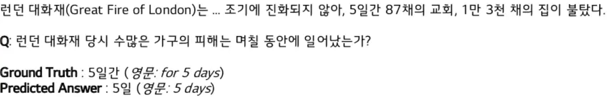
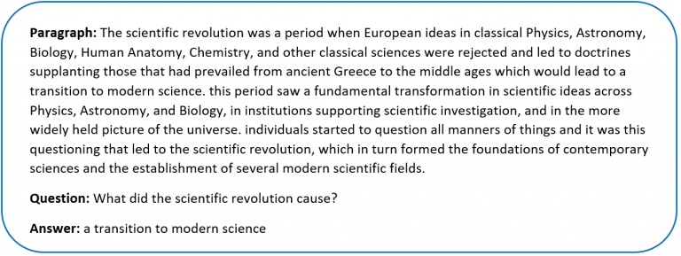

# KorSQuAD-pl

**KorSQuAD-pl**은 한국어와 영어 Question Answering 테스크 데이터셋인 [KorQuAD](https://korquad.github.io/category/1.0_KOR.html)와 [SQuAD](https://rajpurkar.github.io/SQuAD-explorer/)에 대한 전이학습 실험을 할 수 있게 해주는 코드를 제공합니다.

---



---



---

**KorSQuAD-pl**은 다음과 같은 특징들을 가집니다.
* [Huggingface Transformers](https://github.com/huggingface/transformers)의 models에 배포된 Pre-trained Language Model들을 사용
* [PyTorch Lightning](https://www.pytorchlightning.ai/)의 코드 스타일을 통한 코드 구현

## Dependencies
* torch>=1.9.0
* pytorch-lihgtning>=1.3.8
* transformers>=4.8.0
* scikit-learn
* numpy

## Usage

### 1. Dataset 다운로드

**KorSQuAD-pl**에서 제공하는 데이터셋들은 다음과 같습니다.

| 데이터셋        | 링크                                                 | 
| ------------- | --------------------------------------------------- |
| KorQuAD 1.0   | [LINK](https://korquad.github.io/KorQuad%201.0/)    |
| KorQuAD 2.0 (준비중) |  [LINK](https://korquad.github.io/)                 |
| SQuAD 1.1     | [LINK](https://rajpurkar.github.io/SQuAD-explorer/) |
| SQuAD 2.0     | [LINK](https://rajpurkar.github.io/SQuAD-explorer/) |

* KorQuAD 데이터셋의 경우, 아래와 같은 명령어를 실행하면 데이터셋을 자동으로 다운로드 받아 `./data` 경로에 저장됩니다.
  (**현재 KorQuAD 2.0는 아직 완료하지 못했습니다. 빠른 시일 내에 업데이트하도록 하겠습니다.**)
    ```bash
    python download_korquad.py --download_dir ./data
    ```
* SQuAD의 경우, 아래와 같은 명령어를 실행하면 데이터셋을 자동으로 다운로드 받아 `./data` 경로에 저장됩니다.
    ```bash
    python download_squad.py --download_dir ./data
    ```

### 2. Training
다음과 같은 명령어를 통해 전이학습을 수행합니다.

* `--model_type` : 모델의 유형 ex) `bert`
* `--model_name_or_path` : 모델의 이름 또는 경로 ex) `bert-base-uncased`
* `--do_lower_case` : 대문자를 모두 소문자로 바꿀지(uncased model)
* `--data_name` : 전이학습에 사용할 데이터셋 이름
* `--do_train` : 훈련 모드 수행
* `--gpu_id` : 전이학습 수행시 사용할 GPU의 ID
* `--batch_size` : 훈련시의 배치 크기
* `--learning_rate` : 학습률

```bash
$ python3 run_squad.py --model_type bert \
                       --model_name_or_path bert-base-uncased \
                       --do_lower_case \
                       --data_name squad_v2.0 \
                       --do_train \
                       --gpu_id 0 \
                       --batch_size 12 \
                       --learning_rate 3e-5
```

### 3. Evaluation
다음과 같은 명령어를 통해 전이학습에 대한 평가를 수행합니다.

* `--model_type` : 모델의 유형 ex) `bert`
* `--model_name_or_path` : 모델의 이름 또는 경로 ex) `bert-base-uncased`
* `--do_lower_case` : 대문자를 모두 소문자로 바꿀지(uncased model)
* `--data_name` : 전이학습에 사용할 데이터셋 이름
* `--do_eval` : 평가 모드 수행
* `--gpu_id` : 전이학습 수행시 사용할 GPU의 ID
* `--batch_size` : 훈련시의 배치 크기
* `--learning_rate` : 학습률

```bash
python3 run_squad.py --model_type bert \
                     --model_name_or_path bert-base-uncased \
                     --do_lower_case \
                     --data_name squad_v2.0 \
                     --do_eval \
                     --gpu_id 0 \
                     --batch_size 12 \
                     --learning_rate 3e-5
```

### 4. Training and Evaluation
전이학습을 수행한 후에 곧바로 평가를 수행하고자 하면 다음과 같이 `--do_train` 옵션과 `--do_eval` 옵션을 함께 키면 됩니다.

```bash
python3 run_squad.py --model_type bert \
                     --model_name_or_path bert-base-uncased \
                     --do_lower_case \
                     --data_name squad_v2.0 \
                     --do_train \
                     --do_eval \
                     --gpu_id 0 \
                     --batch_size 12 \
                     --learning_rate 3e-5
```

### 5. Formal Evaluation for KorQuAD 1.0

KorQuAD 1.0에 대한 공식 Evaluation Script를 사용하려면 다음과 같은 명령어를 사용합니다.

(SQuAD의 Evaluation Script와 KorQuAD의 Evaluation Script가 차이가 있기 때문에 KorQuAD에 대해 정확한 평가를 하고자 한다면 반드시 다음의 명령어를 통해 평가해야합니다.)

```bash
python3 evaluate_v1_0.py --dataset_file ./data/korquad_v1.0/dev.json \
                         --prediction_file ./model/korquad_v1.0/{$model_type}/predictions_eval.json
```

## Result of Experiments

### 1. KorQuAD 1.0
| Model Type | model_name_or_path                                                                                            | Exact Match (%) | F1 Score (%) |
| ---------- | ------------------------------------------------------------------------------------------------------------- | --------------- | ------------ |
| BERT       | [bert-base-multilingual-cased](https://huggingface.co/bert-base-multilingual-cased)                           |                 |              |
|            | [bert-base-multilingual-uncased](https://huggingface.co/bert-base-multilingual-uncased)                       |                 |              |
|            | [monologg/kobert](https://huggingface.co/monologg/kobert)                                                     |                 |              |
| DistilBERT | [distilbert-base-multilingual-cased](https://huggingface.co/distilbert-base-multilingual-cased)               |                 |              |
|            | [monologg/distilkobert](https://huggingface.co/monologg/distilkobert)                                         |                 |              |
| ELECTRA    | [monologg/koelectra-small-v2-discriminator](https://huggingface.co/monologg/koelectra-small-v2-discriminator) |                 |              |
|            | [monologg/koelectra-base-v2-discriminator](https://huggingface.co/monologg/koelectra-base-v2-discriminator)   |                 |              |
|            | [monologg/koelectra-small-v3-discriminator](https://huggingface.co/monologg/koelectra-small-v3-discriminator) |                 |              |
|            | [monologg/koelectra-base-v3-discriminator](https://huggingface.co/monologg/koelectra-base-v3-discriminator)   |                 |              |

### 2. KorQuAD 2.0 (준비중)
| Model Type | model_name_or_path                                                                                            | Exact Match (%) | F1 Score (%) |
| ---------- | ------------------------------------------------------------------------------------------------------------- | --------------- | ------------ |
| BERT       | [bert-base-multilingual-cased](https://huggingface.co/bert-base-multilingual-cased)                           |                 |              |
|            | [bert-base-multilingual-uncased](https://huggingface.co/bert-base-multilingual-uncased)                       |                 |              |
|            | [monologg/kobert](https://huggingface.co/monologg/kobert)                                                     |                 |              |
| DistilBERT | [distilbert-base-multilingual-cased](https://huggingface.co/distilbert-base-multilingual-cased)               |                 |              |
|            | [monologg/distilkobert](https://huggingface.co/monologg/distilkobert)                                         |                 |              |
| ELECTRA    | [monologg/koelectra-small-v2-discriminator](https://huggingface.co/monologg/koelectra-small-v2-discriminator) |                 |              |
|            | [monologg/koelectra-base-v2-discriminator](https://huggingface.co/monologg/koelectra-base-v2-discriminator)   |                 |              |
|            | [monologg/koelectra-small-v3-discriminator](https://huggingface.co/monologg/koelectra-small-v3-discriminator) |                 |              |
|            | [monologg/koelectra-base-v3-discriminator](https://huggingface.co/monologg/koelectra-base-v3-discriminator)   |                 |              |

### 3. SQuAD 1.1
| Model Type | model_name_or_path                                                                              | Exact Match (%) | F1 Score (%) |
| ---------- | ----------------------------------------------------------------------------------------------- | --------------- | ------------ |
| BERT       | [bert-base-cased](https://huggingface.co/bert-base-cased)                                       |                 |              |
|            | [bert-base-uncased](https://huggingface.co/bert-base-uncased)                                   |                 |              |
| DistilBERT | [distilbert-base-cased](https://huggingface.co/distilbert-base-cased)                           |                 |              |
|            | [distilbert-base-uncased](https://huggingface.co/distilbert-base-uncased)                       |                 |              |
| ALBERT     | [albert-base-v1](https://huggingface.co/albert-base-v1)                                         |                 |              |
|            | [albert-base-v2](https://huggingface.co/albert-base-v2)                                         |                 |              |
| XLNet      | [xlnet-base-cased](https://huggingface.co/xlnet-base-cased)                                     |                 |              |
|            | [xlnet-large-cased](https://huggingface.co/xlnet-large-cased)                                   |                 |              |
| ELECTRA    | [google/electra-small-discriminator](https://huggingface.co/google/electra-small-discriminator) |                 |              |
|            | [google/electra-base-discriminator](https://huggingface.co/google/electra-base-discriminator)   |                 |              |
|            | [google/electra-large-discriminator](https://huggingface.co/google/electra-large-discriminator) |                 |              |

### 4. SQuAD 2.0
| Model Type | model_name_or_path                                                                              | Exact Match (%) | F1 Score (%) |
| ---------- | ----------------------------------------------------------------------------------------------- | --------------- | ------------ |
| BERT       | [bert-base-cased](https://huggingface.co/bert-base-cased)                                       |                 |              |
|            | [bert-base-uncased](https://huggingface.co/bert-base-uncased)                                   |                 |              |
| DistilBERT | [distilbert-base-cased](https://huggingface.co/distilbert-base-cased)                           |                 |              |
|            | [distilbert-base-uncased](https://huggingface.co/distilbert-base-uncased)                       |                 |              |
| ALBERT     | [albert-base-v1](https://huggingface.co/albert-base-v1)                                         |                 |              |
|            | [albert-base-v2](https://huggingface.co/albert-base-v2)                                         |                 |              |
| XLNet      | [xlnet-base-cased](https://huggingface.co/xlnet-base-cased)                                     |                 |              |
|            | [xlnet-large-cased](https://huggingface.co/xlnet-large-cased)                                   |                 |              |
| ELECTRA    | [google/electra-small-discriminator](https://huggingface.co/google/electra-small-discriminator) |                 |              |
|            | [google/electra-base-discriminator](https://huggingface.co/google/electra-base-discriminator)   |                 |              |
|            | [google/electra-large-discriminator](https://huggingface.co/google/electra-large-discriminator) |                 |              |

## TODO list

- [ ] KorQuAD 2.0 업데이트
- [ ] 모델 추가
- [ ] 모든 실험 결과 종합
- [x] ReadME 작성
- [ ] ReadME EN 작성

## References

- [KoBERT](https://github.com/SKTBrain/KoBERT)
- [Huggingface Transformers](https://github.com/huggingface/transformers)
- [KorQuAD](https://korquad.github.io/category/1.0_KOR.html)
- [KorQuAD by graykode](https://github.com/graykode/KorQuAD-beginner)
- [KorQuAD by lyeoni](https://github.com/lyeoni/KorQuAD)
- [KoBert shows low performance on KorQuad](https://github.com/SKTBrain/KoBERT/issues/1)
- [KoBERT-KorQuAD by monologg](https://github.com/monologg/KoBERT-KorQuAD)
- [SQuAD](https://rajpurkar.github.io/SQuAD-explorer/)
- [NVIDIA NeMo](https://github.com/NVIDIA/NeMo)
- [KoELECTRA by monologg](https://github.com/monologg/KoELECTRA)

---

추가적으로 문의 사항이 있으시면 해당 repository의 issue를 등록해주시거나 sehunhu5247@gmail.com으로 문의해주시면 감사하겠습니다.